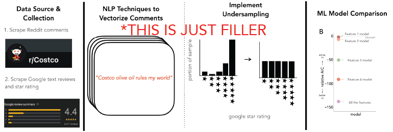
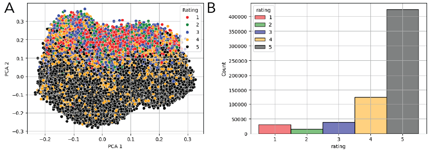
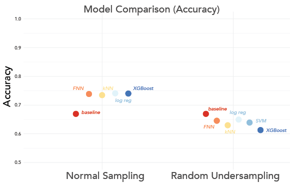
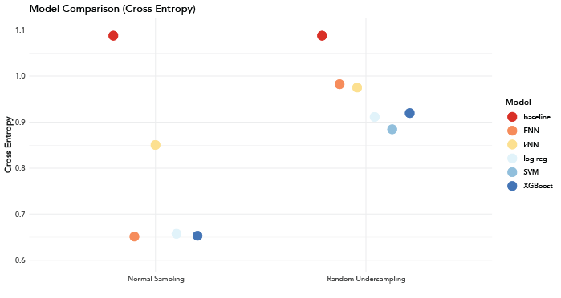

# erdos-companydiscourse
There is a wealth of discourse on companies and their products on social media platforms and online forums. While many approaches leverage analytical techniques to gauge audience sentiment through online discourse, they lack the ability to be both targeted and customizable while maintaining complex analytical integrity.

</img>

 

## Table of Contents
- [Project Title](#project-title)
- [Table of Contents](#table-of-contents)
- [Project Description](#description)
- [Project Structure](#project-structure)
- [Installation & Usage /Reproducability](#installation--usage-reproducability)
- [Data](#data)
- [Models](#models)
- [Results](#results)
- [Contributing](#contributing)
- [License](#license)

## Project Description 
This project utilizes Natural Language Processing (NLP) and Machine Learning (ML) techniques to construct predictive models capable of assessing and rating comments provided by consumers for a **target company**. In this project we used [Costco](https://www.costco.com/) as the target company. By employing these advanced analytical methods, we aim to enhance the accuracy and effectiveness of sentiment analysis in understanding and forecasting consumer behavior. **To view a detailed description of the entire project for Costco as the target company **, please run the [full notebook](https://github.com/dhk628/erdos-companydiscourse/blob/main/final%20notebook.ipynb)

## Project Structure
- `data/`: Directory to store raw and processed data.
  - `raw/`: Contains raw scraped data.
  - `processed/`: Contains processed data ready for analysis.
- `notebooks/`: Jupyter notebooks for exploratory data analysis, preprocessing, vectorization, model training, and evaluation. 
- `notebooks/final_notebook.ipynb` jupyter notebook with full description of data analysis and results
- `scripts/`: Python scripts for data collection, preprocessing, vectorization, model training, and evaluation.
- `models/`: Directory to store trained models.
- `.gitignore`: Files and directories to be ignored by git.
- `README.md`: Project documentation and instructions.
- `erdos_company_discourse.yml`: project environment

## Installation & Usage /Reproducability
1. xx

## Data 
### Overview
- [Google Reviews Data](https://datarepo.eng.ucsd.edu/mcauley_group/gdrive/googlelocal/) costco only.
- Reddit Thread Data 

</img>

 

## Models  
We modeled the data useing the following models: 
- [Baseline Model](#baseline-model) 
- [Logistic Regression](#logistic-regression)
- [K-Nearest Neighbors](#k-nearest-neighbors)
- [Support Vector Machine for Classification](#support-vector-machine-for-classification)
- [XGBoost Classifier](#xgboost-classifier)
- [Feedforward Neural Network](#feedforward-neural-network)
### Results & Model Comparison

</img>

 

</img>

 

## Contributing 
- [Vinicius Ambrosi](personalWebsiteLink)(:
    [vambrosi](https://github.com/vambrosi))
- [Gilyoung Cheong](personalWebsiteLink)(:
    [gycheong](https://github.com/gycheong))
- [Dohoon Kim](personalWebsiteLink)(:
    [dhk628](https://github.com/dhk628))
- [Hannah Lloyd](https://hslloyd.github.io/)(:
    [hslloyd](https://github.com/hslloyd))

