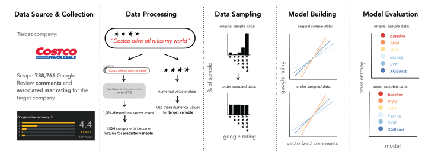
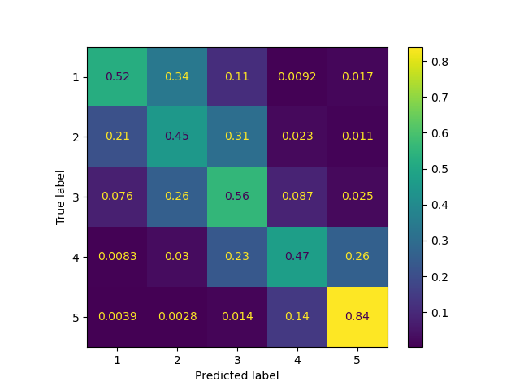

# Company Discourse
## Finding Numerical Ratings of Consumer Sentiments using GTE Sentence Transformers

</img>
There is a wealth of information in the discourse on companies and their products on social media platforms and online forums. This project aims to build and train machine learning (ML) models to predict google star reviews from google text reviews for a target company. This approach is computationally efficient, while maintaining contextual integrity in the data and leveraging complex analytical techniques to gauge audience sentiment through online discourse.

**To view a detailed description of the entire project**, please see our [final Jupyter notebook](https://github.com/dhk628/erdos-companydiscourse/blob/main/final_notebook.ipynb).

## Authors
- [Vinicius Ambrosi](https://www.linkedin.com/in/vinicius-ambrosi/) (:
    [vambrosi](https://github.com/vambrosi))
- [Gilyoung Cheong](https://www.linkedin.com/in/gycheong/) (:
    [gycheong](https://github.com/gycheong))
- [Dohoon Kim](https://www.linkedin.com/in/dohoonkim95/) (:
    [dhk628](https://github.com/dhk628))
- [Hannah Lloyd](https://www.linkedin.com/in/hslloyd/) (:
    [hslloyd](https://github.com/hslloyd))

## Table of Contents
- [Project Description](#project-description)
- [Motivation](#motivation)
- [Project Structure](#project-structure)
- [Installation, Usage, and Reproducability](#installation-usage-and-reproducability)
- [Exploratory Data Analysis](#exploratory-data-analysis)
- [Model Performances](#model-performances)
- [Conclusion](#conclusion)
- [Future Directions](#future-directions)
- [References](#references)

## Project Description
This project utilizes Natural Language Processing (NLP) and ML techniques to construct predictive models capable of assessing and rating comments provided by consumers for a **target company**. In this project we used [Costco](https://www.costco.com/) as the target company. By employing these advanced analytical methods, we aim to enhance the accuracy and effectiveness of sentiment analysis in understanding and forecasting consumer behavior.

## Motivation

Online comments and reviews have grown increasingly vital in shaping consumer decisions, particularly in the aftermath of the COVID-19 pandemic. Numerous studies, including [[1]](https://www.frontiersin.org/journals/psychology/articles/10.3389/fpsyg.2022.865702/full), [[3]](https://link.springer.com/chapter/10.1007/978-981-19-5443-6_1), [[8]](https://ieeexplore.ieee.org/document/8970492), [[9]](https://www.sciencedirect.com/science/article/pii/S0747563210000907), [[10]](https://ieeexplore.ieee.org/document/8631160), and [[11]](https://www.sciencedirect.com/science/article/abs/pii/S1567422320300570), have underscored the significance of analyzing consumer sentiments within the realms of e-commerce and tourism. The importance of these sentiments has been highlighted, showing that understanding consumer feedback can provide valuable insights into market trends and customer preferences. In light of these findings, this project utilizes NLP and ML techniques to construct predictive models capable of assessing and rating comments provided by consumers. By employing these advanced analytical methods, we aim to enhance the correctness and effectiveness of sentiment analysis in understanding and forecasting consumer behavior.

## Project Structure
- `notebooks/`: Jupyter notebooks for exploratory data analysis, preprocessing, vectorization, model training, and evaluation
- `final_notebook.ipynb` Jupyter notebook with full description of data analysis and results
- `scripts/`: Python scripts for data collection, preprocessing, vectorization, model training, and evaluation
- `models/`: Directory to store trained models
- `.gitignore`: Files and directories to be ignored by git
- `README.md`: Project documentation and instructions
- `erdos_company_discourse.yml`: Project environment
- `presentation_slides.pdf` : Presentation slides

## Installation, Usage, and Reproducability
The final models for the project are stored in the [`models`](https://github.com/dhk628/erdos-companydiscourse/tree/main/models) folder. The model for support vector classification is large and is stored in [Google Drive](https://drive.google.com/file/d/1lqYpduA7rfBSZCMB_yUyadeiGKJsFb9B/view?usp=sharing). To apply them to reviews you need to:
1. Vectorize a list of reviews using `SentenceTransformer("thenlper/gte-large").encode(reviews)` from the package [sentence-transformers](https://www.sbert.net/).
2. Load one of the models and apply `model.predict(review_vectors)` to the corresponding vector list.

To reproduce the training and testing done for this project you need to:
1. Download the complete review data from [Google Reviews Data](https://datarepo.eng.ucsd.edu/mcauley_group/gdrive/googlelocal/) to the folder `data/raw/` (omitted in the GitHub repo due to file size).
2. Run `google_preprocessing.ipynb` to extract the reviews of your target company (Costco in our case).
3. `sbert_vectorizing.py` contains the necessary code to vectorize and store the reviews.
4. Use `scikit_models.py` to train scikit-learn models, and `xgboost_training.ipynb` and `neural_network_implementation.ipynb` to train the respective models.

## Exploratory Data Analysis
### Overview
We used the dataset [Google Local Data](https://datarepo.eng.ucsd.edu/mcauley_group/gdrive/googlelocal/) to train our models. This dataset includes all Google Maps reviews from 2021 in the United States, up to September 2021. We extracted all reviews associated with a Costco location (usually there is more than one Google Map ID for each Costco warehouse), and we excluded all reviews that were not in English. We did not alter the review text in any way before vectorizing.

After exclusions, the dataset includes 788766 reviews from 2473 unique Google Maps locations. We use [Sentence Transformers](https://sbert.net/), a state-of-the-art text embedding NLP, to vectorize the reviews. These vectors then serve as input features for building predictive models for ratings. The pre-trained model for our sentence transformer is GTE (General Text Embeddings with Multi-stage Contrastive Learning) developed by Alibaba Group NLP team in [[5]](https://arxiv.org/abs/2308.03281).

We use 80% of the review vectors with ratings as our training data and the rest as test data. The training data is heavily biased towards 5 stars, with the distribution being:

| Rating | Count  | Percentage |
|:-------|-------:|-----------:|
| 5      | 528011 | 66.94%     |
| 4      | 154481 | 19.59%     |
| 3      | 48264  | 6.12%      |
| 2      | 18805  | 2.38%      |
| 1      | 39205  | 4.97%      |
    

We used 66.94% as the baseline accuracy for our models, which corresponds to always predicting 5 stars. The following is the complete list of model generation techniques we used:

- Baseline Model (i.e., always predict 5 stars)
- Logistic Regression
- K-Nearest Neighbors
- Support Vector Machine for Classification
- XGBoost Classifier
- Feedforward Neural Network

### Data Visualization

</img>

* **A**: the scatter plot of our training set projected on the first and second principal components: note the *imbalance* in our data
* **B**: the histogram for ratings in our testing set

## Model Performances

### Models with Original Sampling (imblanced training data)

| No Undersampling | baseline | log reg |   kNN  | XGBoost |   FNN  |
|:----------------:|:--------:|:-------:|:------:|:-------:|:------:|
|     Accuracy     |  0.6694  | 0.7410  | 0.7347 | 0.7402 | 0.7386 |
|   Cross Entropy  |  1.0877  | 0.6569  | 0.8564 | 0.6532 | 0.6515 |
|   Correlation  |  undefined  | 0.6656 | 0.7418 | 0.7483 | 0.7693 |

**Remark**. kNN is with 50 neighbors and PCA with 16 components.

### Models with Random Undersampling (blanced training data)

| Random Undersampling | baseline | log reg |   kNN  |   SVM  | XGBoost |   FNN  |
|:--------------------:|:--------:|:-------:|:------:|:------:|:-------:|:------:|
|       Accuracy       |  0.6694  |  0.6500 | 0.6315 | 0.6389 |  0.6130 | 0.6455 |
|     Cross Entropy    |  1.0877  |  0.9101 | 0.9790 | 0.8823 |  0.9196 | 0.9823 |
|   Correlation  |  undefined  | 0.8198 | 0.7924 | 0.8144 | 0.7968 | 0.8085  |

**Remark**. kNN is with 200 neighbors and PCA with 128 components; SVM is with rbf kernal and PCA with 128 components.

Above, **Correlation** means correlation of rows and columns of normalized confusion matrix (see "noramlized correlation" in $\S2$ of our [final notebook](https://github.com/dhk628/erdos-companydiscourse/blob/main/final_notebook.ipynb) for more details).

### Accuracy Plotting

</img>

### Cross Entropy Plotting

</img>

### Best Performance: Logistic Regression

| Logistic Regression | No Undersampling | Random Undersampling | 
|:--------------------:|:--------:|:-------:|
|       Confusion Matrix      | </img> |  </img> |
| Accuracy | 0.7410 | 0.6500 |
| Cross Entropy | 0.6569 | 0.9101 |
| Correlation | 0.6656 | 0.8198 |

* The most cost-effective model
* Outperforming other more convoluted models
* Undersampling produces a more reasonable prediction for overall ratings $\Rightarrow$ Correlation may be a better evaluation metric

### Performance on Other Rating Data 

We also test our best perfoming model (Logistic Regression) on the rating data that we scraped from Costco's website, which is an entirely different source from our training data (i.e., Google Reviews). These are 8621 review comments with ratings. We use the same model that was built before without extra training, and we vectorize all 8621 comments to use them as extra test data.

| Testing on New Data | No Undersampling | Random Undersampling | 
|:--------------------:|:--------:|:-------:|
|       Confusion Matrix      | </img> |  </img> |
| Accuracy | 0.7989 | 0.7404 |
| Cross Entropy | 0.5493 | 0.7486 |
| Correlation | 0.6679 | 0.8201 |

## Conclusion

In this project, we used GTE Sentence Transformers to vectorize the text of Google reviews, which we then used to predict the corresponding star rating. Due to the imbalanced nature of our data, accuracy was not deemed to be the best metric to evaluate our models. We instead also consider the cross entropy loss and the normalized correlation of the confusion matrices. Logistic regression, k-nearest neighbors, support vector classification, XGBoost, and feedforward neural networks all had lower cross entropy than the baseline when trained with the original data. We were able to significantly improve the normalized correlation by randomly undersampling the training data. However, across all models, this came with the cost of higher cross entropy and lower accuracy than those obtained by training on the original data. In both approaches, our models perform well--even for data from other sources--without the need to train the vectorization, signicantly reducing the computational cost for users.

## Future Directions

There are several avenues by which this project can be futher investigated. Firstly, we could consider other metrics that are more suited for imbalanced data, such as the geometric mean or the Area Under the Receiver Operating Characteristic Curve (ROC AUC). Furthermore, we could employ other undersampling or oversampling methods, although many of these come with a significantly higher computational cost than randomly undersampling. The choice of sentence transformer, i.e. using a pre-trained vectorization model other than GTE, could also affect our results. Finally, we could train and test unsupervised models using text data with no ratings, for example, comments on Reddit.

## References

<a id="1">[1]</a> 
T. Chen, P. Samaranayake, X. Cen, M. Qi, and Y. Lan. (2022). "**The Impact of Online Reviews on Consumers’ Purchasing Decisions: Evidence From an Eye-Tracking Study**," Front Psychol. **13**: 865702.

<a id="1">[2]</a> 
Jacob Devlin, Ming-Wei Chang, Kenton Lee, Kristina Toutanova. (2019). "**BERT: Pre-training of Deep Bidirectional Transformers for Language Understanding**," Proceedings of the 2019 Conference of the North American Chapter of the Association for Computational Linguistics: Human Language Technologies, Volume 1 (Long and Short Papers)

<a id="1">[3]</a> 
M. S. Kim, K. W. Lee, J. W. Lim, D. H. Kim, and S. Hong. (2023). "**Ranking Roughly Tourist Destinations Using BERT-Based Semantic Search**", Shakya, S., Du, KL., Ntalianis, K. (eds) Sentiment Analysis and Deep Learning. Advances in Intelligent Systems and Computing, vol 1432. Springer, Singapore.

<a id="1">[4]</a>
Jiacheng Li, Jingbo Shang, and Julian McAuley. (2022). "**UCTopic: Unsupervised Contrastive Learning for Phrase Representations and Topic Mining**," Annual Meeting of the Association for Computational Linguistics (ACL)

<a id="1">[5]</a>
Z. Li, X. Zhang, Y. Zhang, D. Long, P. Xie, and M. Zhang. (2023)."**Towards General Text Embeddings with Multi-stage Contrastive Learning**," arXiv preprint: https://arxiv.org/abs/2308.03281

<a id="1">[6]</a>
N. Reimers and I. Gurebych. (2019). "**Sentence-BERT: Sentence Embeddings using Siamese BERT-Networks**," Proceedings of the 2019 Conference on Empirical Methods in Natural Language Processing and the 9th International Joint Conference on Natural Language Processing, p.3982–3992, Hong Kong, China, November 3–7, 2019.

<a id="1">[7]</a>
An Yan, Zhankui He, Jiacheng Li, Tianyang Zhang, and Julian Mcauley. (2023). "**Personalized Showcases: Generating Multi-Modal Explanations for Recommendations**,"The 46th International ACM SIGIR Conference on Research and Development in Information Retrieval (SIGIR)

<a id="1">[8]</a>
L. Yang, Y. Li, J. Wang, and R. S. Sherratt. (2020). "**Sentiment Analysis for E-Commerce Product Reviews in Chinese Based on Sentiment Lexicon and Deep Learning**," IEEE Access **8**: p.23522-23530.

<a id="1">[9]</a>
Qiang Ye, R. Law, B. Gu, and W. Chen. (2011). "**The influence of user-generated content on traveler behavior: An empirical investigation on the effects of e-word-of-mouth to hotel online bookings**,"  Computers in Human Behavior **2**: p.634-639.

<a id="1">[10]</a>
Zhang and Zhong. (2019). "**Mining Users Trust From E-Commerce Reviews Based on Sentiment Similarity Analysis**," IEEE Access **7**: p.13523-13535.

<a id="1">[11]</a>
Y. Zhao, L. Wang, H. Tang, and Y. Zhang. (2020). "**Electronic word-of-mouth and consumer purchase intentions in social e-commerce**," Electronic Commerce Research and Applications, **41**: 100980.
